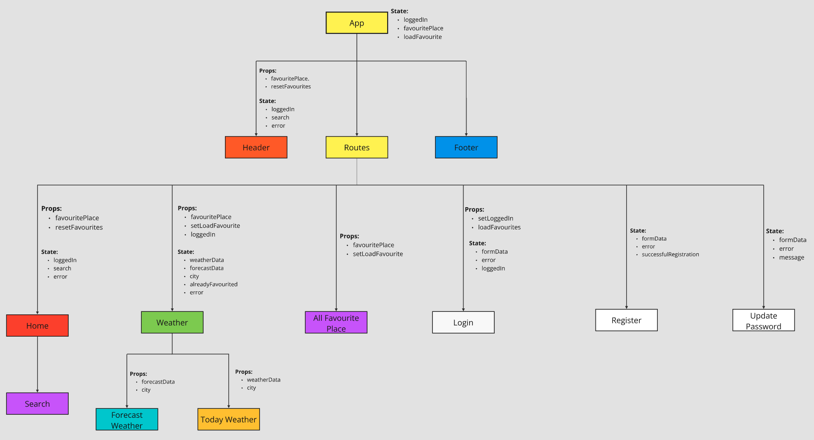

# Component hierarchy

# Reasoning for hierarchy

## App Component
### State:
- `loggedIn`: Boolean indicating if the user is logged in.
- `favouritePlace`: Array of user's favourite locations.
- `loadFavourite`: Boolean to trigger reloading of favourite locations.

### Props: None

### Children:
- **Header Component**
  - **Props:**
    - `favouritePlace`: Array of user's favourite locations.
    - `resetFavourites`: Function to clear favourite places.
- **Routes**
  - **Home Component**
    - **Props:** None
  - **Weather Component**
    - **Props:**
      - `favouritePlace`: Array of user's favourite locations.
      - `setLoadFavourite`: Function to trigger reloading of favourite locations.
      - `loggedIn`: Boolean indicating if the user is logged in.
    - **State:**
      - `weatherData`: Object containing current weather data.
      - `forecastData`: Object containing forecast weather data.
      - `city`: String indicating the current city.
      - `alreadyFavourited`: Boolean indicating if the current city is already a favourite.
      - `error`: Object containing error message, type, and display flag.
    - **Children:**
      - **TodayWeather Component**
        - **Props:**
          - `weatherData`: Object containing current weather data.
          - `city`: String indicating the current city.
      - **ForecastWeather Component**
        - **Props:**
          - `forecastData`: Object containing forecast weather data.
          - `city`: String indicating the current city.
  - **Login Component**
    - **Props:**
      - `setLoggedIn`: Function to set the logged-in state.
      - `loadFavourites`: Function to load favourite locations.
  - **Register Component**
    - **Props:** None
  - **UpdatePassword Component**
    - **Props:** None
  - **AllFavouritePlaces Component**
    - **Props:**
      - `favouritePlace`: Array of user's favourite locations.
      - `setLoadFavourite`: Function to trigger reloading of favourite locations.
- **Footer Component**
  - **Props:** None

## State Planning

### 3 State Questions

#### Which component should own the state?
- The `App` component should own the state for `loggedIn`, `favouritePlace`, and `loadFavourite` because these states are used by multiple components and affect the overall application behavior.
- The `Weather` component should own the state for `weatherData`, `forecastData`, `city`, `alreadyFavourited`, and `error` because these states are specific to the weather data and its presentation.

#### Which components need to read the state?
- `loggedIn` is needed by:
  - `Header` to show/hide login/logout options.
  - `Weather` to display user-specific weather data.
- `favouritePlace` is needed by:
  - `Header` to display a list of favourite places.
  - `AllFavouritePlaces` to display all favourite places.
  - `Weather` to check if the current weather location is a favourite.
- `loadFavourite` is needed by:
  - `Weather` to trigger reloading of favourite places when a favourite is added or removed.
  - `AllFavouritePlaces` to trigger reloading of favourite places list after a removal.
- `weatherData`, `forecastData`, `city`, `alreadyFavourited`, and `error` are needed within the `Weather` component and its child components (`TodayWeather` and `ForecastWeather`).

#### Which components need to change the state?
- `loggedIn` can be changed by:
  - `Login` component after successful login.
- `favouritePlace` can be changed by:
  - `App` component when loading favourites from the API.
- `loadFavourite` can be changed by:
  - `Weather` component when adding/removing a favourite location.
  - `AllFavouritePlaces` component when removing a favourite location.
- `weatherData`, `forecastData`, `city`, `alreadyFavourited`, and `error` can be changed by the `Weather` component when fetching weather and forecast data or handling favourite locations.
